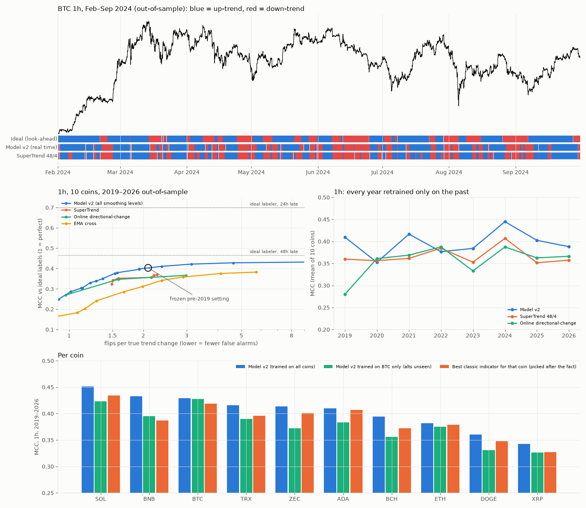
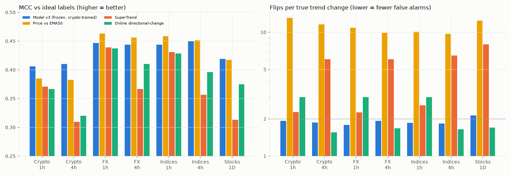

# مصنّف اتجاه للعملات الرقمية (LightGBM) — اختبار خارج العينة 2019–2026

## الهدف والملصِّق المثالي
- **الهدف:** Oracle labeling (Kovačević et al., IEEE Access 2023): برمجة ديناميكية ترى المستقبل وتختار مسار صعود/هبوط يعظّم العائد مع تكلفة لكل تغيير اتجاه، فتتجاهل الارتدادات الصغيرة.
- **التكلفة مقاسة بالتقلب السابق** (`k=1`)، فيكون حجم الترند واحدًا بعدد الشموع على كل الفريمات:
  - 1h: الترند النموذجي حوالي 5 أيام وحركة حوالي 12%.
  - 4h: حوالي 19 يومًا وحركة حوالي 24%.

## منع التسريب والأوفر فيتنج
| الخطر | الإجراء |
|---|---|
| ميزة ترى المستقبل | كل الـ 159 ميزة سببية، والفريم الأعلى لا يُستخدم إلا بعد إغلاق شمعته. `leaktest_features.py` يعيد حساب الميزات على بيانات مقطوعة، والفرق = **0** بالضبط |
| ملصق التدريب يرى ما بعد نقطة القطع | الملصقات يُعاد حسابها على البيانات حتى نقطة القطع فقط، ويُستخدم منها فقط الجزء النهائي (نقطة التقاء مسارات Viterbi: لا يتغير مع أي بيانات جديدة؛ اختُبر: 0 مخالفات)، ثم embargo إضافي 24 شمعة |
| ضبط على فترة الاختبار | Optuna وكل باراميترات المؤشرات الكلاسيكية مضبوطة على بيانات **قبل 2019** فقط، ثم مجمدة |
| انحياز للسوق الصاعد | تدريب على نسخ مقلوبة من كل سوق (السعر → 1/السعر، والملصق ينعكس تمامًا)، للتدريب فقط |
| الإعادة السنوية | Walk-forward: كل سنة يُعاد التدريب على الماضي فقط، ويُختبر على السنة كاملة |
| اختبار placebo | تدريب على ملصقات مُزاحة (خاطئة عمدًا) → MCC خارج العينة **0.02** (مقابل 0.43 للنموذج الحقيقي) |
| التعميم | نموذج مدرب على BTC فقط يعمل على 9 عملات لم يرها (MCC 0.38 مقابل 0.40)؛ وفريم 2h لم يُدرَّب عليه إطلاقًا |

## النتائج خارج العينة (10 عملات، 2019-01 → 2026-09، متوسط العملات)
| فريم 1h | MCC | دقة | انعكاسات لكل انعكاس حقيقي | دقة إشارة الانعكاس | جزء الترند الضائع قبل الكشف |
|---|---|---|---|---|---|
| **النموذج v2 (الإعداد المجمد)** | **0.403** | **70.3%** | 2.09 | **73%** | 44% |
| SuperTrend 48/4 (أفضل باراميتر قبل 2019) | 0.370 | 68.6% | 2.27 | 71% | 40% |
| Online directional change | 0.367 | 68.5% | 2.98 | 66% | 33% |
| EMA 5/50 | 0.383 | 69.2% | 5.76 | 58% | 34% |
| Regime استراتيجية XAUSTBreakFree | 0.144 | 57.4% | 0.69 | 86% | 64% |
| الملصق المثالي متأخرًا 24 ساعة | 0.70 | 85% | 1 | — | — |
| الملصق المثالي متأخرًا 48 ساعة | 0.47 | 74% | 1 | — | — |

عند نفس مستوى الانعكاسات (≤2 لكل انعكاس حقيقي): النموذج 0.40 مقابل 0.35 لأفضل مؤشر كلاسيكي. يتفوق على SuperTrend في 80% من أزواج (عملة × سنة).



## حدود صادقة
- الـ MCC المثالي = 1. النموذج يعادل ملصقًا مثاليًا متأخرًا حوالي 50 ساعة، ويكتشف الترند بعد مرور حوالي 44% من حركته. هذا حد أساسي: لو أمكن كشف الترند مبكرًا بدقة عالية لكان السوق قابلًا للتنبؤ بسهولة.
- كإشارة تداول (long/short أو long/flat برسوم 0.05%) **لا يتفوق على الشراء والاحتفاظ**. هو مصنّف اتجاه وليس استراتيجية.
- ميزات الاتساع (breadth) وميزات سياق BTC لم تضف تحسنًا ملموسًا.

## التشغيل
```
python -m tc.tune           # ضبط قبل 2019 (v1) + باراميترات المؤشرات
python -m tc.v2 tune        # ضبط v2 (breadth + حد الانعكاسات) قبل 2019
python -m tc.v2 wf          # walk-forward 2019-2026
python -m tc.walkforward full|btc_only|no_ctx|placebo
python -m tc.final_eval     # الجدول النهائي
python -m tc.final_model    # نموذج الإنتاج + الحالة الحالية لكل عملة
```
البيانات: Binance 1h من [Speirsy11/crypto-dataset](https://github.com/Speirsy11/crypto-dataset) (عبر media.githubusercontent.com)، وBitstamp BTC من [ff137/bitstamp-btcusd-minute-data](https://github.com/ff137/bitstamp-btcusd-minute-data) لفترة 2013–2017.

---
## v3 + الاختبار الحاسم (تسجيل مسبق)
الملفات في `prereg/`: قواعد القرار وشروط النجاح مكتوبة **قبل** التشغيل، ومسجّلة في commit سابق للنتائج (`ed14d43`، 15:14 UTC).

**المرحلة 1: التطوير على بيانات قبل 2019 فقط** (تحقق على 3 سنوات: 2016 و2017 و2018)
| المرشح | الميزات | متوسط أفضل 5 تجارب |
|---|---|---|
| A: الميزات السابقة | 159 | 0.369 |
| B: + Bollinger/ATR | 192 | 0.377 |
| **C: ميزات السعر الفردية فقط + Bollinger/ATR** (بدون سياق BTC / اتساع السوق / الحجم) | 161 | **0.389** ← الفائز، ونموذج واحد لكل الأسواق |

**المرحلة 2: كريبتو 2019–2026 (تشغيل واحد):** MCC 0.406 على 1h (v2 كان 0.403) بمعدل 1.9 انعكاس لكل انعكاس حقيقي. عند ≤2 انعكاس: 0.41 مقابل 0.35 لأفضل مؤشر.

**المرحلة 3: أسهم وفوركس لم يرها النموذج أبدًا** (نفس النموذج المدرب على الكريبتو، بدون أي تعديل)
| | MCC النموذج | أفضل مؤشر (Price vs EMA50) | انعكاسات النموذج / المؤشر | P1 | P2 (عند ≤2 انعكاس) | P3 (≥60% من الأدوات) |
|---|---|---|---|---|---|---|
| FX 1h (6) | 0.446 | 0.463 | 1.8 / 10.8 | ❌ | ✅ 0.448 مقابل 0.427 | ❌ 0% |
| FX 4h (6) | 0.443 | 0.456 | 1.9 / 9.9 | ❌ | ✅ 0.447 مقابل 0.411 | ❌ 33% |
| مؤشرات 1h (9) | 0.444 | 0.459 | 1.9 / 10.0 | ❌ | ✅ 0.444 مقابل 0.427 | ❌ 11% |
| مؤشرات 4h (9) | 0.450 | 0.452 | 1.8 / 9.7 | ❌ | ✅ 0.450 مقابل 0.427 | ❌ 56% |
| 50 سهمًا، يومي (فريم جديد) | 0.419 | 0.417 | 2.1 / 12.4 | ✅ | ✅ 0.399 مقابل 0.375 | ❌ 38% |

**القراءة:**
- لا أوفر فيتنج: النموذج المدرب على الكريبتو لم ينهَر على أسواق وفريمات لم يرها (MCC 0.42–0.45، أعلى من الكريبتو نفسه).
- لكن الادعاء "أفضل بكثير من المتوسطات" **فشل** في الدقة الخام: Price vs EMA50 يساويه أو يتفوق عليه قليلًا، مع 5–6 أضعاف الإشارات الكاذبة.
- الميزة الثابتة الوحيدة في كل الأسواق: **نفس الدقة تقريبًا مع إشارات انعكاس أقل بكثير وأصدق (74–77% صحيحة)**.



## Final verdict (stages 5–7) — indicator and trading tool testing complete

### Stage 5 — inside the original Jesse strategy (only `regime()` replaced), 21 assets
`results_stage5_jesse.csv`, `stage5_jesse.png`. MODEL-4h beats ORIGINAL on Sharpe in 2/6 crypto, 1/7 gold+FX,
6/8 indices (where the strategy loses money anyway). Pre-registered question: yes only for indices.

### Stage 6 — cross-sectional features (absorption ratio, correlation, dispersion, rank)
`results_stage6_cross_section_features.csv`. No robust gain (MCC unchanged; the only positive signal at k=2
reverses at k=3). See `RESEARCH_breadth_cross_section.md`.

### Stage 7 — the indicator as a standalone long/flat trading tool, 92 series, costs included
`results_stage7_trading.csv`, `results_stage7_wins.csv`, `stage7_trading.png`, `prereg/PREREG_stage7_trading.md`.
Median long/flat Sharpe: crypto MODEL 0.51 vs EMA200 0.24, SuperTrend 0.36, buy & hold 0.48;
stocks 0.19 vs EMA200 0.19, buy & hold 0.32; FX and indices negative for every signal.
Series where MODEL Sharpe > EMA200: crypto 7/12, FX 7/12, indices 7/18, stocks 28/50 — none significant (sign test).
MODEL beats SuperTrend on stocks 35/50 (p=0.007) and online DC on crypto 10/12 (p=0.04); loses to buy & hold
on most series. It trades 2–5x less than the moving-average rules and survives doubled costs / one-bar delay
better than they do. Pre-registered question: MODEL beats EMA200 on the majority in crypto, FX and stocks but
not significantly; it does not beat the best baseline of each group except in crypto (vs EMA200 as best, 7/12).

**Bottom line:** the classifier is a clean, low-turnover trend filter that roughly matches the best simple
rules and cuts drawdown versus buy & hold in crypto, but it is not a source of alpha: no market group shows
a significant, consistent edge over EMA200 or over buy & hold.

## Stage 8 — best FX filter (G10 vs USD, daily 1974-2026), pre-registered
`prereg/PREREG_stage8_fx.md`, `prereg/PREREG_stage8b_fx_carry.md`, `results_stage8_fx_trend.csv`,
`results_stage8b_fx_carry.csv`, `stage8_fx.png`.
- 8 (14 trend filters: TSMOM, EMA cross, Donchian, continuous trend, ensemble): every one had dev Sharpe 0.69–1.11
  in 1974-2004; out of sample 2005-2026 all but two are negative. Selected (continuous trend): 1.11 -> -0.11
  (buy & hold short-USD -0.24; difference CI [-0.41, +0.77]). Oanda pairs 2006-2020 check: 0.16 vs -0.17.
- 8b (11 carry / cross-sectional filters, JST annual rates, test to 2020): selected (carry filtered by trend)
  1.06 -> -0.07; plain carry -0.08; cross-sectional momentum -0.4 to -0.7; dollar carry -0.34.
- Verdict: the classic FX premia (trend, carry, momentum) were strong until ~2004 and have not paid since,
  consistent with the literature on their decay. No pre-registered filter beats the FX market out of sample.

## Stage 9 — technical-only trend filters on the top-50 US stocks (pre-registered)
`prereg/PREREG_stage9_stocks.md`, `results_stage9_stocks.csv`, `stage9_stocks.png`.
Selected on 1996-2010: market timing by breadth (% of the 50 above own SMA200 > 50%).
Test 2011-2026: Sharpe 1.11 vs equal-weight buy & hold 1.08 (difference CI [-0.17, +0.21], not significant);
CAGR 15.5% vs 20.4%; vol 13% vs 17%; max DD -27.5% vs -30.8% (COVID -26% vs -31%, 2022 -14% vs -23%).
Of the 12 filters only 2 beat buy & hold on test Sharpe (both by < 0.04). Momentum top-5 had the highest CAGR
(28.9%) but lower Sharpe (0.93) and deeper drawdown. Verdict: technical filters can trade some return for a
smaller drawdown, but none beats buy & hold on risk-adjusted return. Universe has strong look-ahead bias
(today's 50 largest), so absolute returns are inflated for every line.

## Stage 10 — one trend model for any single stock (pre-registered, ticker AND time hold-outs)
`prereg/PREREG_stage10_stock_model.md`, `prereg/FROZEN_stage10.json`, `prereg/FROZEN_stage10b.json`,
`results_stage10_stock_model.csv`, `results_stage10b_calm.csv`, `trend_model_stocks.txt`, `stage10_stock_model.png`.
LightGBM + Optuna (40 trials) on 177 causal features incl. choppiness (Choppiness Index, EMA20 cross rate,
variance ratio, trend R^2) and market context; trained on 300 tickers before 2011; tested once 2011-2026 on
A = 50 large caps and B = 510 other stocks, none seen in training.
- Accurate version (MCC-tuned): median MCC 0.431 (A) / 0.445 (B) vs best tuned indicator (price vs EMA50)
  0.398 / 0.421; beats it on 38/50 (p=3e-4) and 354/510 (p=1e-18) stocks; beats EMA200 on 47/50 and 462/510.
  Holds in 2011-2018 and 2019-2026. PRIMARY ENDPOINT MET. But ~6 flips per true trend change.
- Calm versions (<= 2 flips per true change, chosen on validation only): the crypto-trained model C is the
  best calm classifier (MCC 0.41/0.43, flip precision 73-75%), beating calm-tuned EMA cross, SuperTrend and
  directional-change on 72-96% of stocks (all p<0.003); the calm stock model is slightly behind C.
- Trading long/flat: no version beats buy & hold Sharpe per stock (these classify trend, they are not alpha).
