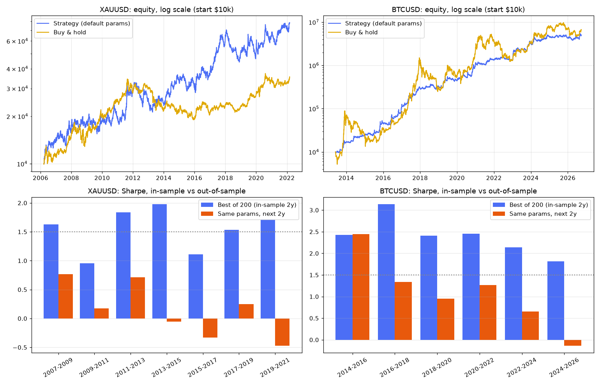

# مراجعة مستقلة لاستراتيجية XAUSTBreakFree (Jesse)

نسخة Python منقولة سطرًا بسطر من كود الاستراتيجية الأصلي (`xau_bt.py`)، ومختبرة على بيانات **لم تُستخدم في تحسينها**
(هو حسّنها على 2024–2026)، وعلى أسواق أخرى بنفس الباراميترات.

## البيانات (مصادر مفتوحة على GitHub)
| السوق | المصدر | الفترة |
|---|---|---|
| ذهب XAU/USD | Oanda (FutureSharks/financial-data) + MT4 h1 (ejtraderLabs/historical-data) | 2006-03 → 2022-03 |
| EUR/USD | نفس المصدرين | 2005 → 2022-03 |
| S&P 500 / Nasdaq-100 (CFD) | Oanda | 2005 → 2020-05 |
| BTC/USD | Bitstamp 1m (ff137/bitstamp-btcusd-minute-data) | 2013-06 → 2026-09 |

لم يتوفر مصدر مفتوح للذهب بالساعة بعد 2022-03 ولا لأسهم فردية بالساعة من داخل بيئة التشغيل.
التشغيل: `bash fetch_oanda.sh` (يحتاج clone لـ FutureSharks في `fd/`)، ثم `python load_data.py` ثم `run1/2/3.py`.

## النتائج (الباراميترات الافتراضية كما هي، رسوم 0.02%)
| السوق | Sharpe | CAGR | Max DD | Sharpe شراء واحتفاظ |
|---|---|---|---|---|
| ذهب 2006–2022 | 0.65 | 13.8% | −38% | 0.53 |
| ذهب في السوق الهابط 2011-09 → 2015 | 0.15 | +0.9% | −35% | −0.64 |
| BTC 2013–2026 | 1.56 | 59.5% | −25% | 1.04 |
| BTC 2024–2026 (نفس فترته) | 0.70 | 15% | −21% | — |
| EUR/USD | −0.16 | −5.5% | −76% | −0.09 |
| S&P 500 | −0.12 | −4.5% | −67% | 0.38 |
| Nasdaq-100 | 0.02 | −1.9% | −62% | 0.62 |

- **ألفا/بيتا (ذهب 2006–2022):** ألفا ≈ 11.5% سنويًا، t = 1.93 (على حافة المعنوية)، بيتا 0.46.
- **حذف أفضل الصفقات (ذهب):** من 549 صفقة؛ حذف أفضل 3 → CAGR من 15% إلى 9%؛ حذف أفضل 10 → ~0%.
- **انزلاق 0.05% فقط:** شارب الذهب من 0.65 إلى 0.45؛ EUR/USD ينهار (−94%).
- **Deflated Sharpe لنتيجته (2.03 على سنتين، 200 تجربة):** أعلى شارب متوقع بالصدفة ≈ 1.96 → DSR ≈ 0.52 (عملة معدنية).
- **200 مجموعة باراميترات عشوائية:** ذهب: 72% موجبة، الوسيط 0.17، والافتراضية عند المئين 99.5. BTC: 99% موجبة، الوسيط 1.27.
- **إعادة تمثيل طريقته (أفضل 200 على نافذة سنتين ← السنتين التاليتين):**
  ذهب: متوسط in-sample ≈ 1.5 → out-of-sample ≈ 0.15. BTC: ≈ 2.4 → ≈ 1.1 (= وسيط كل الباراميترات، يعني التحسين لم يضف شيئًا).

## تحفظات على هذا النقل
- شموع 1h بدل 1m: لو لمس الشمعة الستوب والهدف معًا نفترض الستوب أولًا؛ الفجوة عبر الستوب تُنفّذ عند الافتتاح (أكثر تحفظًا من Jesse).
- بيانات Oanda/MT4 وليست "Custom Data" الخاصة بـ Jesse، لذا الأرقام السنوية تختلف عن خريطته لكن الاتجاه متسق (2017 قوي، 2018 سلبي، 2021 موجب والذهب سالب).
- funding على العقود الدائمة غير محسوب إلا في اختبار BTC (10% سنويًا → شارب 1.49).
